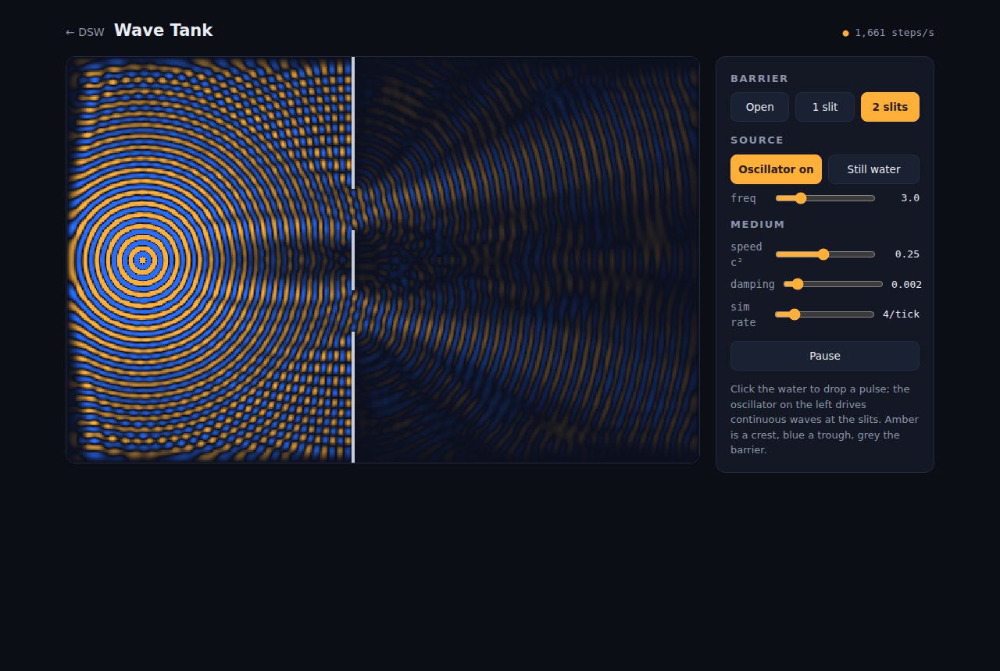
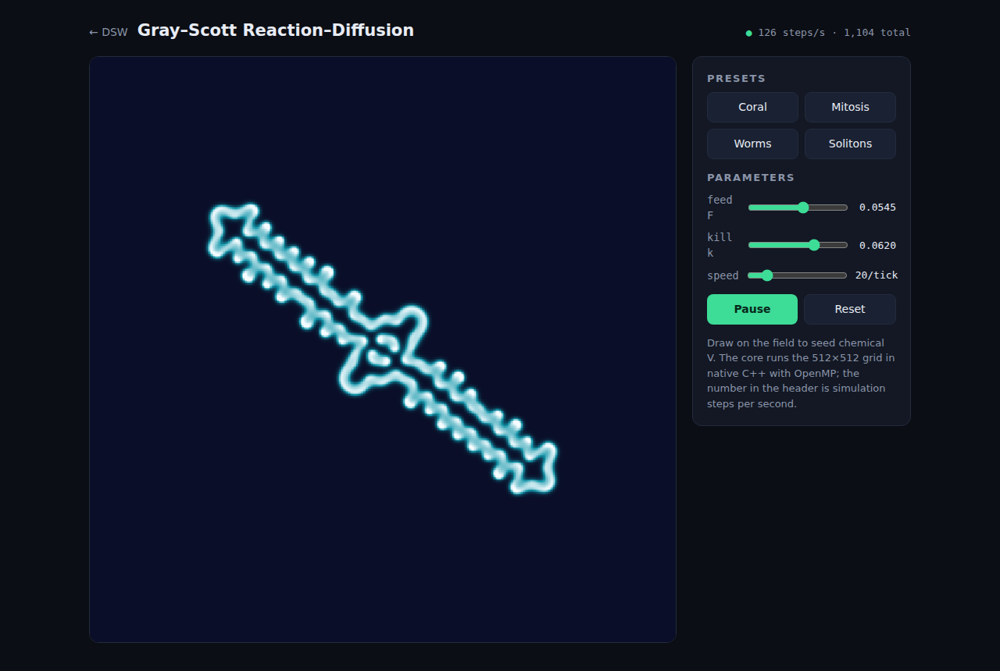

# DSW — Digital Science Workstation

A "DAW for science": a small, polished host that runs **DEX** (digital
experiment) plugins — native C++ simulation cores with HTML/JS front-ends —
the way a DAW runs VST3 instruments. Installing an experiment is dropping a
folder into `plugins/`; the browser is the GUI; the heavy math runs native.

```
        browser (GUI)                      dsw host (native)
  ┌──────────────────────┐   WebSocket   ┌──────────────────────────────┐
  │ plugin's ui/index.html│◄────────────►│ session worker thread        │
  │  + /dex.js shim       │  JSON ctrl   │   └─ your C++ core           │
  │  canvas ◄─ RGBA frames│  bin frames  │      (OpenMP / SIMD / GB RAM)│
  └──────────────────────┘               └──────────────────────────────┘
```

## Why not VST3?

A DAW *would* work as a plugin loader — VST3 plugins are ordinary shared
libraries and hosts don't limit their memory or threading. But everything
about the API is audio-shaped: you'd implement audio buses and a realtime
`process()` callback you don't want, squeeze state through normalized 0–1
parameters, embed your GUI through per-platform `IPlugView` plumbing, and
ship Steinberg's dual-licensed SDK — all to smuggle science through a music
pipe. DSW keeps the two properties that make VST3 pleasant — **a tiny stable
binary ABI** and **drop-in-folder installation** — and discards the rest.
The whole plugin contract is one header, [`include/dex_plugin.h`](include/dex_plugin.h),
with seven functions.

## Build & run

Needs CMake ≥ 3.15 and a C++17 compiler (OpenMP optional but recommended).

```sh
cd dsw
cmake -B build -DCMAKE_BUILD_TYPE=Release
cmake --build build -j
./dsw                  # open http://127.0.0.1:8090/
```

The host binds **localhost only** and serves the launcher, each plugin's
`ui/` folder, and one WebSocket per running experiment. `./dsw --help` lists
`--port`, `--plugins DIR`, `--web DIR`.

Ships with two example experiments:

| Plugin | What it shows |
|--------|---------------|
| `gray-scott` | Gray–Scott reaction–diffusion on a 512×512 torus: presets, F/k sliders, paint-to-seed brush, steps/s telemetry. |
| `wave-tank` | Damped 2D wave equation with absorbing shores and single/double-slit barriers: poke the water, drive an oscillator, watch interference fringes form. |

<p>
  
  
</p>

## Anatomy of a plugin bundle

```
plugins/my-experiment/
├── dex.json               # launcher card: name, description, accent, version
├── my-experiment.so       # the compiled core (.dll on Windows, .dylib on mac)
├── ui/
│   └── index.html         # the front-end; only ui/ is web-visible
└── src/plugin.cpp         # source (optional, not served)
```

Installing = copying that folder into `plugins/` and refreshing the
launcher. No registry, no manifest editing anywhere else.

### The native side (7 functions)

```c
#include "dex_plugin.h"

void *create(void);                       // one browser tab = one instance
void destroy(void *inst);
int  advance(void *inst, double dt);      // called in a loop; return 0 = idle
void on_message(void *inst, const char *json, size_t len);  // UI -> core
const char *poll_message(void *inst);     // core -> UI, NULL when drained
int  render(void *inst, dex_frame *out);  // fill RGBA8, return 1

extern "C" DEX_EXPORT const dex_plugin_api *dex_plugin_entry(void) { ... }
```

The host serializes all calls for one instance onto one worker thread, so a
plugin needs **no locks** — and whatever it does internally (OpenMP loops,
thread pools, gigabytes of field data) is its own business. `render()` is
only called when the browser asks for a frame, so display pace and
simulation pace are decoupled: the sim runs flat out, the canvas gets at
most one frame per display refresh, and a slow sim never builds up latency.

[`include/dex_msg.h`](include/dex_msg.h) has small helpers for reading the
flat JSON control messages.

### The browser side

```html
<script src="/dex.js"></script>
<script>
  const dex = DEX.connect({
    canvas: document.getElementById("view"),  // frames auto-draw here
    onMessage(m) { /* JSON from the core */ },
  });
  dex.send({ t: "set", k: "feed", v: 0.034 });
</script>
```

`/dex.js` (served by the host) opens the WebSocket, paces frame requests
with `requestAnimationFrame`, and blits incoming RGBA frames to your canvas.
Message vocabulary is entirely yours — the host just relays JSON.

## Porting an HTML/JS DEX prototype

1. Copy the prototype page into `ui/index.html`; delete its simulation loop,
   keep its controls and styling.
2. Rewrite the inner loop in `src/plugin.cpp` (usually a near-transliteration
   of the JS, plus `#pragma omp parallel for` on the field loop).
3. Wire each control to `dex.send({t:"set", k:..., v:...})` and handle it in
   `on_message`; draw into the RGBA buffer in `render()`.
4. Add the folder to `CMakeLists.txt` (`dsw_add_plugin(my-experiment)`),
   build, refresh the launcher.

The two shipped plugins are meant as templates — `wave-tank` for
click-interaction and mode switches, `gray-scott` for parameter sweeps and
brushes.

## Protocol (for the curious)

* `GET /api/plugins` — rescan `plugins/` and list bundles (this is what makes
  drop-in install work; the launcher calls it on every load).
* `GET /plugins/<id>/ui/...` — a bundle's static UI files. Only `ui/` is
  reachable; binaries, sources and `..` paths are refused.
* `WS /ws/<id>` — one experiment session. Text frames are JSON control
  messages both ways; the literal text `f` requests one frame; binary frames
  are `"DXF1"` + u32le width + u32le height + RGBA8.

Replacing a plugin **binary** while the host is running requires a host
restart (loaded libraries are cached); UI files and newly dropped bundles
are picked up on refresh.

## Portability

Linux and macOS build as-is. The code carries Winsock/`LoadLibrary` paths
for Windows (MSVC + CMake) but they are untested so far — the development
host is Linux.
